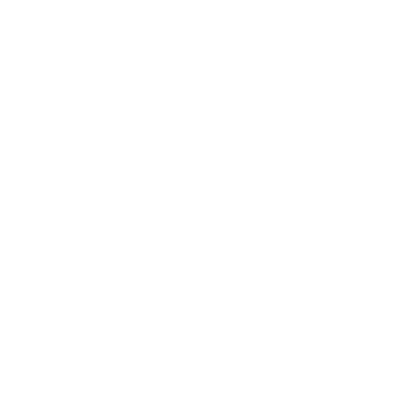

<div align="center">
  
  <h1 align="center" style="font-size: 3rem; margin: 0.5rem 0;">SMP</h1>
  <p align="center" style="font-size: 1.2rem; color: #4da3ff; font-weight: 500;">
    Software Maintenance Project
  </p>
  <p align="center">
    Plataforma de gestión de mantenimiento informático, soporte técnico y cursos formativos.
  </p>
</div>

---

## 📋 Descripción

**SMP** es una aplicación web completa diseñada para la gestión de servicios de mantenimiento informático. Permite a los clientes contratar planes de suscripción o pago único, solicitar reparaciones a distancia, abrir tickets de soporte, gestionar pagos y acceder a cursos formativos.

### 🌐 Web

La aplicación está disponible en:**[https://smp.pages.dev](https://smp.pages.dev)**

---

## ⚙️ Tecnologías utilizadas

### Frontend

| Tecnología | Uso |
|------------|-----|
| **React 19** | Librería de interfaz de usuario |
| **TypeScript** | Tipado estático |
| **Vite 8** | Bundler y dev server |
| **Framer Motion** | Animaciones |
| **CSS Modules** | Estilos modulares |

### Backend

| Tecnología | Uso |
|------------|-----|
| **Node.js / Express** | Servidor API REST |
| **TypeScript** | Tipado estático |
| **MongoDB + Mongoose** | Base de datos |
| **JWT** | Autenticación |
| **Resend** | Envío de emails |

### DevOps

| Tecnología | Uso |
|------------|-----|
| **Cloudflare Pages** | Hosting del frontend |
| **Render** | Hosting del backend |
| **GitHub** | Control de versiones |

---

## ✨ Funcionalidades principales

- 🔐 **Autenticación** con registro, login y verificación por email
- 📦 **Planes de suscripción** (Básico, Pro, Completo) y pago único (Learning)
- 🛠️ **Contratación de servicios** de mantenimiento
- 🎫 **Tickets de soporte** técnico
- 💻 **Reparación a distancia**
- 💳 **Gestión de métodos de pago** (tarjeta, transferencia, bizum)
- 📚 **Curso formativo** incluido en el plan Learning
- 👨‍💼 **Panel de administración** con gestión de usuarios, contratos y soporte

---

## 📦 Instalación y uso

```bash
# Clonar el repositorio
git clone https://github.com/aruidel3012/SMP.git

# Instalar dependencias
cd SMP && npm install

# Variables de entorno (backend)
# Copiar .env.example y rellenar los valores
cp .env.example .env

# Iniciar en desarrollo (API + Frontend simultáneamente)
npm run dev

# Solo backend
npm run dev:api

# Solo frontend
npm run dev:web

# Build producción
npm run build
```

---

## 👥 Creado por

<div align="center">
  <table>
    <tr>
      <td align="center">
        <strong>Antonio Alejandro Ruiz Delgado</strong>
      </td>
      <td align="center">
        <strong>Pablo Castañeda Martin</strong>
      </td>
    </tr>
  </table>
  <br />
  <strong>Curso 2º SMR</strong>
</div>

---

<div align="center">
  <sub>© 2026 SMP - Software Maintenance Project</sub>
</div>
